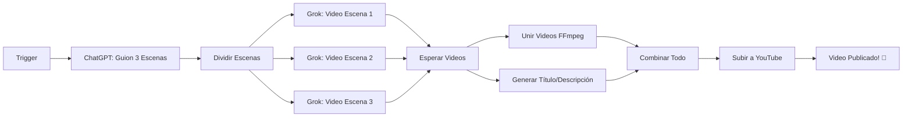

# YouTube Firefighter Shorts - Automatización con n8n 🚒🔥

## 📋 Descripción General

Este workflow de n8n automatiza completamente la creación de YouTube Shorts para tu canal [@Virex-k4j6k](https://www.youtube.com/@Virex-k4j6k). El sistema genera videos de 15 segundos en formato 9:16 sobre bomberos salvando personas, animales y situaciones extremas.

## 🎬 Flujo de Trabajo



## ⚙️ Requisitos Previos

### 1. APIs Necesarias

- **OpenAI API** (ChatGPT)
  - Obtener key: https://platform.openai.com/api-keys
  - Modelo recomendado: `gpt-4` o `gpt-4-turbo`

- **Grok API** (xAI)
  - Obtener key: https://x.ai/api
  - **NOTA IMPORTANTE**: La API de video de Grok aún no está públicamente disponible. Tendrás que:
    - **Opción A**: Esperar a que xAI lance su API de generación de video
    - **Opción B**: Usar alternativas como:
      - **Runway Gen-2/Gen-3** (https://runwayml.com)
      - **Pika Labs** (https://pika.art)
      - **Stable Video Diffusion**
      - **Luma AI** (https://lumalabs.ai)

- **YouTube Data API v3**
  - Configurar OAuth2: https://console.cloud.google.com
  - Habilitar YouTube Data API v3
  - Configurar pantalla de consentimiento OAuth
  - Crear credenciales OAuth 2.0

### 2. Software en n8n Server

- **FFmpeg** (para unir videos)
  ```bash
  # Ubuntu/Debian
  sudo apt update && sudo apt install ffmpeg
  
  # macOS
  brew install ffmpeg
  
  # Windows
  # Descargar de: https://ffmpeg.org/download.html
  ```

### 3. n8n Instalado

- **n8n Cloud**: https://n8n.io (más fácil)
- **Self-hosted**:
  ```bash
  npm install -g n8n
  n8n start
  ```

## 📥 Instalación del Workflow

### Paso 1: Importar el Workflow

1. Abre n8n
2. Haz clic en el menú superior derecho
3. Selecciona **"Import from File"**
4. Carga el archivo `n8n-youtube-firefighter-automation.json`

### Paso 2: Configurar Credenciales

#### OpenAI (ChatGPT)

1. En n8n, ve a **Settings** → **Credentials** → **New**
2. Busca **"OpenAI"**
3. Nombre: `OpenAI API`
4. API Key: `tu-api-key-de-openai`
5. Guarda

#### Grok/Alternativa de Video

> [!WARNING]
> La API de Grok para video aún no existe públicamente. Usa una alternativa:

**Para Runway ML**:
1. Regístrate en https://runwayml.com
2. Obtén tu API key
3. En n8n: **Credentials** → **HTTP Header Auth**
4. Nombre: `Runway API`
5. Nombre del Header: `Authorization`
6. Valor: `Bearer tu-runway-api-key`

**Para Luma AI**:
1. Regístrate en https://lumalabs.ai
2. Configura similar a Runway

#### YouTube OAuth2

1. Ve a https://console.cloud.google.com
2. Crea un nuevo proyecto
3. Habilita **YouTube Data API v3**
4. Crea credenciales **OAuth 2.0**
5. Redirect URL: `https://tu-n8n-instance.com/rest/oauth2-credential/callback`
6. En n8n:
   - **Credentials** → **YouTube OAuth2**
   - Client ID: `tu-client-id`
   - Client Secret: `tu-client-secret`
   - Conecta tu canal de YouTube

### Paso 3: Ajustar Nodos

#### Nodo "Grok - Video Generation"

Dependiendo de la API que uses, ajusta el endpoint:

**Para Runway ML**:
```json
{
  "url": "https://api.runwayml.com/v1/generate",
  "body": {
    "prompt": "={{ $json.sceneDescription }}, cinematic POV firefighter rescue, dramatic, 9:16 aspect ratio",
    "duration": 5,
    "ratio": "9:16"
  }
}
```

**Para Luma AI**:
```json
{
  "url": "https://api.lumalabs.ai/v1/generations",
  "body": {
    "prompt": "={{ $json.sceneDescription }}, POV firefighter rescue scene, cinematic, vertical video",
    "aspect_ratio": "9:16",
    "duration": 5
  }
}
```

#### Nodo "Merge Videos (FFmpeg)"

Si usas **n8n Cloud**, FFmpeg no estará disponible. Alternativas:

1. **Usar n8n Self-Hosted** (recomendado)
2. **API de edición de video**:
   - Cloudinary
   - Shotstack (https://shotstack.io)
   - Creatomate

**Ejemplo con Shotstack**:
```json
{
  "url": "https://api.shotstack.io/v1/render",
  "body": {
    "timeline": {
      "tracks": [
        {
          "clips": [
            {"asset": {"src": "={{ $json.videos[0].url }}"}, "start": 0, "length": 5},
            {"asset": {"src": "={{ $json.videos[1].url }}"}, "start": 5, "length": 5},
            {"asset": {"src": "={{ $json.videos[2].url }}"}, "start": 10, "length": 5}
          ]
        }
      ]
    },
    "output": {
      "format": "mp4",
      "resolution": "hd"
    }
  }
}
```

## 🚀 Uso del Workflow

### Ejecución Manual

1. Abre el workflow en n8n
2. Haz clic en **"Execute Workflow"**
3. Espera 2-5 minutos (dependiendo de las APIs)
4. ¡El video se subirá automáticamente a YouTube!

### Ejecución Automática

El nodo **Schedule Trigger** puede configurarse para:

- **Diario**: Cada día a las 9:00 AM
  ```
  Cron: 0 9 * * *
  ```

- **Cada 2 días**:
  ```
  Cron: 0 9 */2 * *
  ```

- **3 veces por semana** (Lunes, Miércoles, Viernes):
  ```
  Cron: 0 9 * * 1,3,5
  ```

## 🎨 Personalización

### Modificar Estilo de Videos

En el nodo **"ChatGPT - Script Generation"**, ajusta el prompt:

```javascript
"Create a dramatic firefighter rescue script for a 15-second YouTube Short. 

STYLE: [Elige uno]
- Heroic and inspirational
- Intense and action-packed
- Emotional and heartwarming
- Suspenseful and dramatic

SCENARIOS: [Personaliza]
- Building fires
- Car accidents
- Animal rescues
- Natural disasters
- Medical emergencies

Each scene 5 seconds. Format with SCENE 1, SCENE 2, SCENE 3."
```

### Ajustar Título y Descripción

En **"Generate Title & Description"**:

```javascript
"Create a viral YouTube title and description for this firefighter rescue.

STYLE:
- Use fire and rescue emojis (🚒🔥💪👨‍🚒)
- Keep title under 60 characters
- Make it clickable and emotional
- Add trending hashtags: #firefighter #rescue #hero #shorts #viral #pov #extreme #emergency

TARGET AUDIENCE: English-speaking, ages 18-45, interested in action and heroism"
```

## 📊 Monitoring y Logs

### Ver Resultados

Después de cada ejecución:

1. Ve a **Executions** en n8n
2. Revisa cada nodo:
   - ✅ Verde = Éxito
   - ❌ Rojo = Error
3. Haz clic en cada nodo para ver:
   - Input data
   - Output data
   - Errores (si los hay)

### Errores Comunes

| Error | Solución |
|-------|----------|
| `OpenAI rate limit` | Espera unos minutos y reintenta |
| `YouTube quota exceeded` | YouTube tiene límite de 6 subidas/día |
| `FFmpeg not found` | Instala FFmpeg o usa alternativa cloud |
| `Video generation failed` | Revisa los créditos de tu API de video |

## 💡 Tips para Viralizar

1. **Frecuencia**: Sube 1-2 shorts por día
2. **Horarios**: Publica entre 6-9 PM (hora de tu audiencia)
3. **Títulos**: Usa palabras como "EXTREME", "INSANE", "UNBELIEVABLE"
4. **Hashtags**: #shorts #firefighter #rescue #hero #viral #pov
5. **Thumbnails**: El primer frame del video debe ser impactante
6. **Duración**: 15 segundos es perfecto para Shorts
7. **Engagement**: Responde a comentarios rápidamente

## 🔧 Troubleshooting

### El workflow no se ejecuta

- Verifica que el Schedule Trigger esté activado
- Revisa que n8n esté corriendo
- Comprueba los logs de n8n

### Videos no se generan

- Verifica créditos de API de video
- Revisa que el prompt sea claro
- Asegúrate de pedir formato 9:16

### No se sube a YouTube

- Verifica OAuth2 esté conectado
- Comprueba que el canal sea tuyo
- Revisa límites de YouTube API

## 📈 Próximas Mejoras

- [ ] Añadir música de fondo automática
- [ ] Subtítulos automáticos
- [ ] Análisis de rendimiento de videos
- [ ] A/B testing de títulos
- [ ] Integración con TikTok/Instagram

## 🆘 Soporte

Si tienes problemas:

1. Revisa los logs de n8n
2. Verifica que todas las APIs tengan créditos
3. Asegúrate de que FFmpeg esté instalado (si usas self-hosted)
4. Consulta la documentación de n8n: https://docs.n8n.io

---

> [!IMPORTANT]
> **NOTA SOBRE GROK**: La API de generación de video de Grok (xAI) aún no está disponible públicamente. Este workflow usa un placeholder. Cuando esté disponible, simplemente actualiza el nodo con el endpoint correcto.

> [!TIP]
> **RECOMENDACIÓN**: Usa **Runway Gen-3** o **Luma AI** temporalmente. Ambas son excelentes para generar videos cortos y cinematográficos.

¡Buena suerte con tu canal de YouTube! 🚒🔥🎬
